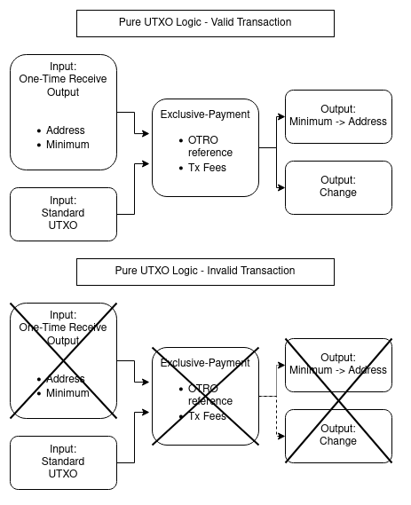
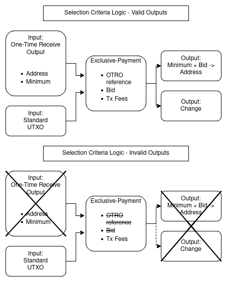

# Saito Implementation Protocol -- 002 One-Time Receive Outputs

## Abstract

This document describes a special transaction output, *one-time receive output* (OTRO), not locked to any key pair, and its associated transaction type, *exclusive-payment*, which consumes as input a one-time receive output it references and outputs a minimum amount of tokens to a specific address. If the OTRO has already been spent, the outputs will be invalid, allowing multiple parties to 'bid' over the right to send Saito to an address with only one party ultimately paying.

This addition allows logic on layer 2 to securely accept layer 1 Saito payments without the possibility for multiple layer 1 transactions being accepted while layer 2 logic can only honor one of them. The design hopes to respect and preserve the benefits Saito holds by keeping transaction validation as simple as possible, especially in the early stages of network development.

| Field   | Value                   |
| ------- | ----------------------- |
| Author  | Matthew Wilson          |
| Status  | Proposed                |
| Type    | Implementation Proposal |
| Created | April 3, 2023           |

## 1. Layer 2 Contract Systems

Layer 2 contract systems work similarly to layer 1 contract system, like Ethereum, but adopt their transaction ordering, security and infrastructure from a layer 1 blockchain. Moving execution systems like this onto the second layer keeps the base chain insulated from any unforeseen consequences the added economic complexity of tracking and computing arbitrary state might introduce while allowing the layer 2 to inherit the security properties of the base chain.

There is no theoretical barrier preventing such a layer 2 system from existing in exactly this way atop Saito's chain today, but limitations in Saito's transaction logic do prevent the secure and trustless exchange of native layer 1 Saito tokens for computation on any layer 2. A layer 2 with no changes to Saito Protocol would require a minting and distribution of its own token isolated from the Saito token, or an external bridging service to wrap and unwrap native Saito tokens which would force reliance on other chains or brokers.

## 2. Non-revertible Transactions; Risks in Using Layer 1 Saito on a Layer 2

The most basic difference which sets a contract chain apart from a non-contract chain is the ability to accept transactions but redirect the tokens associated based on the internal state of the blockchain, rather than simply approving or rejecting transactions from the chain wholly based on their cryptographic validity and prevention of double spending.

The Saito Protocol wisely avoids compromising its economic and security guarantees by not introducing requirements for nodes to process arbitrary logic. It is, however, this mismatch in the requirements of a layer 2 contract system and the capabilities of Saito transaction validity logic which prevents trustless, native token interoperability with its own layer 2 systems.

Consider for example, a non-fungible token is held by some address as indexed by layer 2 contract nodes, and the owner would like to sell it for 100 Saito. There is nothing presently preventing the layer 2 contract system from honoring the logic of such an offer and recognizing the new ownership of that token as soon as a layer 1 Saito transaction sends 100 Saito to the correct address. The issue is the risk involved with attempting that purchase: if two or more users send 100 Saito to claim that token, and all are published on-chain, the layer 2 logic will accept the first and reject the rest, but layer 1 Saito will accept all transactions as valid, leaving any incidentally late buyers short 100 Saito without anything to show for it.

This dynamic greatly discourages the spending of layer 1 Saito on a layer 2 at all - and encourages interested nodes to withhold data that a limited-use piece of logic has already been triggered if it means more users will unsuspectingly send subsequent transactions which will pay some contract but fail to provide its rewards for redundant triggers. A full state tracking system like a traditional contract chain is not required to overcome this hurdle; it can be achieved with a special transaction input and output and the normal operations of tracking valid outputs through the UTXO set.

## 3. Proposed Additions: One-Time Receive Output (OTRO) & Exclusive-Payments

A one-time receive output is a special transaction output which does not send Saito to any address but can be used as a necessary transaction input to an exclusive-payment transaction which references that OTRO. The ability to 'spend' a OTRO as a transaction input is not restricted to any particular address, and a OTRO is considered spent when it is consumed as an input which sends a minimum quantity of Saito tokens to a specific address, with both of these values specified in field of the one-time receive output which the exclusive-payment references.

Users sending exclusive payments ensure that their payment is either the sole payment to an address, or is not counted. This is accomplished in its most basic form by consensus rules requiring that an exclusive-payment contains as an input a valid OTRO from the UTXO set. More nuanced logic to avoid issues described in *Unintended Costs and Potential Exploits* is defined in *Selection Criteria*.

In practice:

Alice wants to allow potential buyers to send her 100 Saito tokens in exchange for something, it could be an off-chain agreement or the authority to execute layer-2 logic. Alice composes and publishes a OTRO with an argument specifying 100 Saito as the minimum which is added to the UTXO set for anyone to use.

Bob and Charles are each interested in fulfilling Alice's request, so they each compose an exclusive-payment transaction which requires three properties for validity:

1) It must reference an OTRO which is in the UTXO set.
2) It must contain that OTRO as a transaction input.
3) It must contain an output which is greater than or equal to the minimum specified in the OTRO, directed towards the address specified in the OTRO.

Even if Bob, Charles and whoever else send their 100 Saito to Alice at the same time, the OTRO required to validate each transaction may only be consumed for one of them. Any logic which honors payment to Alice can then be carried through, and potential buyers may participate without fear of coming in late *and* losing their Saito. It is the senders' responsibility to verify that the layer 2 logic or agreement matches properly with the OTRO.

## 4. Unintended Costs and Potential Exploits

Though fee-bidding wars are a legitimate market dynamic associated with the claim over a OTRO, there are situations in which nodes may become bogged down in transactions which all attempt to spend the OTRO, burdening first-hop nodes when the single accepted fee may not adequately compensate. This may be considered an attack on the network. Malicious actors may craft OTROs with fraudulent offers in order encourage participants en masse to flood transaction data towards nodes where ultimately only one of those transactions will be required to pay transaction fees.

It may appear the issue is solved by ensuring that *all* exclusive-payment transactions are valid fee-paying transactions but only allowing one to consume the OTRO it references and thus generate a valid UTXO. Exclusive-send transactions would embody a special class of transaction which may be considered valid to be included on-chain and pay fees, but may also contain a UTXO which is not valid.

This is a trade-off. With a single, valid, fee-paying, exclusive-payment - block producers may select the exclusive-payment which pays them the highest fee and ignore all others. But when all exclusive-payments are valid to impart fees, the block producer has no reason to select any exclusive-payment over another as they can always choose which transaction spends the OTRO while still earning all of the fees - pure MEV.

## 5. Selection Criteria

First hop nodes may be relieved of the potential for spam attacks without the ability to arbitrarily choose winners if all exclusive-payments are allowed as fee-paying transactions, and a selection criteria governed by the free market and consensus rules is introduced.

Competing exclusive-payments (those in the same block) would resolve the winner through an included 'bid' field, separate from the transaction fee, which designates a quantity of tokens willing to be paid towards the creator of the OTRO in excess of the minimum. Block producers who attempt to exclude exclusive-payments from bidding must delay their use of those transactions until the next block and thus impose costs on themselves for censoring. The optimal strategy would derive from the normal Saito strategy: include as many profitable transactions as possible as quickly as possible.

Users competing for priority would have to include a fee high enough for first inclusion into the chain as well as a 'bid' which is greater than any competing exclusive-payments in the same block. If multiple exclusive-payments are in the same block and contain the same bid amount, the hash which determines the winner of the consensus lottery can be used to determine tie-breakers for exclusive-payments. The winning exclusive-payment is allowed to consume the OTRO as an input, validating all of its outputs, while the losing transactions would be valid enough (assuming the sender can sign for the fee) to pay the transaction fee, but would have their UTXOs ignored.

The following diagrams show the difference between simple UTXO logic and selection criteria logic for exclusive spend transactions:

Negative logic invalidates entire transaction, including fees.
 

Negative logic invalidates just the transaction outputs, but preserves fees.

Advantages:

- One-time receives allow seamless interoperability with layer 1 Saito and layer 2 execution systems, preventing the need for new or wrapped tokens. Layer 2 systems may run solely on native Saito tokens while not exposing layer 1 consensus to any risks associated with layer 2 development.

- The computation and storage burden of one-time receive outputs is negligibly greater than standard transactions.

- It is perhaps the simplest while most effective enabler of arbitrary logic to take place atop Saito; Saito would remain computationally far simpler than even Bitcoin and thus provably reliable without shutting the door on layer 2 systems to use trustlessly consume the native token.

- The transaction type is simple and flexible enough to have potential use cases far simpler and more accessible than complex layer 2 systems.

Disadvantages:

- Using the simpler approach: enticing many users to send exclusive-payment transactions in a bid to fulfill a popular one-time receive output may fill the mempool of nodes with a large amount of transactions of which only a single one can be counted for consensus work and rewards. Competition should drive up the fees attached to the winning transaction, but it is not clear if that will make it worthwhile in all situations.

- Solving the above problem adds complexity in the form of bid amounts and *valid* fee-paying transactions which have attached *invalid* transaction outputs.

- May be a slippery slope for more transaction logic. If other layer 1 logic seems comparably useful, then accepting this change would make denying additions more difficult. Saito's current transaction logic is sparse, and this change could commit development in a certain direction and remove flexibility as the network is still budding.

It is the previous concern which motivates the points made regarding the fundamental nature of a distributed contract system:

"The basic functionality of a distributed contract system is the ability to determine transaction validity not just based on authorization from a private key, but also the internal state of the system in relation to the transaction."

The author believes that one-time receive outputs are the simplest possible, and sufficiently simple transaction logic so as to not introduce exploits targeting validation node running the logic, which grants Saito the fundamental property required to trustlessly spend the native Saito token on the execution of arbitrary logic with negative externalities isolated to layer 2 systems.

## 6. Alternative Approach Not Requiring a Saito Protocol Change

If it is possible to solve this problem purely in the layer 2 implementation, it is worth understanding what, if any, trade-offs exist. The core issue is any situation where any user may send Saito in exchange for layer 2 logic execution - so it may be solved by limiting layer 2 logic such that only one address at a time is allowed to execute that logic.

In the example of selling an NFT, rather than using the chain to post a public offer which can be acted upon, an informal offer is made public by Alice to sell her NFT for 100 Saito. Bob contacts her privately and informs her he is interested, and so Alice forms a transaction which says in layer 2 logic "When Bob sends 100 Saito to my address and references this transaction, transfer ownership of this NFT to him."

This relies on a safety condition in place on the layer 2: "Alice may not overwrite this offer to a different address than Bob's or with a different price until X blocks later," Bob can send the Saito tokens ensured that as long as his transaction is published before Alice's overwrite expiration, that he will certainly execute the logic he intended to.

The upside to this approach is that it is possible today. The two major downsides are the lack of trustlessness and the need to delay new offers on the same contract logic. If Alice could overwrite her offer logic quickly after posting her latest offer, she could trick users into sending her Saito which in fact earns them nothing in return on the layer 2. Malicious would-be buyers also have the ability to express interest only to never follow through, and Alice would be wasting fees and would end up stuck waiting for offers to single addresses to expire before she could try to make a new one with a buyer of genuine interest.

This greatly restricts such an alternative approach to parties who have enough trust not to lock each other into proposing offers which are never fulfilled. This approach would not be suitable for truly public contract markets, but may be acceptable for friends trading NFTs used to peer-2-peer gaming - even still, the urge to expand such communities and trade outside trusted circles will ultimately lead into a territory where public trolling of offers cannot be prevented. 

The approach is still interesting, and may be further ameliorated through trading channels where reputation plays a role; it is often the case in digital markets that deals are made entirely on trust with the party 'going second' having the full ability to scam the other for sometimes tens of thousands of dollars - those deals are made leveraged on reputation. In this alternative approach, the risk of a bad deal is reduced all the way down to time wasted waiting for a contract to expire and the fees spent posting it, therefore requiring far less reputation to initiate successful trades. There is also the added benefit of all users being able to record and archive these trades as they happen on-chain in order to build reputation profiles for themselves and other users.

While compelling, this approach still cannot avoid the trade-offs of low throughput and some required trust between parties. When mulling over the proposed changes in this SIP, it may be useful to compare this best case alternative with what can be opened up if the SIP is accepted: the ability to use native Saito coin for fully trustless, high throughput layer 2 execution.